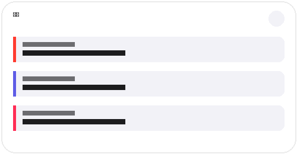
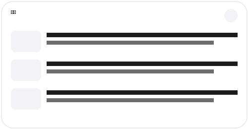
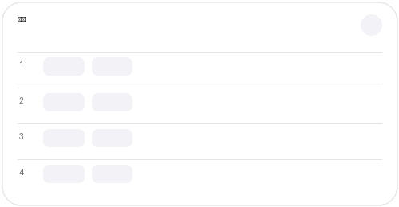

<div align="center">

# SceneGets

**RESCENE의 일정, 뉴스, 음원 차트를 한눈에 확인하는 Android 앱 & 홈 화면 위젯**

<br>


<br>

RESCENE의 정보를 앱을 열지 않아도 홈 화면에서 빠르게 확인할 수 있도록 만든 비공식 팬 앱입니다.

</div>

---

## ✨ 주요 기능

### 📅 스케줄
- RESCENE의 예정 스케줄 확인
- 오늘의 일정 및 전체 일정 제공
- 멤버 생일 일정 자동 표시
- 원하는 일정에 알림 설정 가능
- 일정 시작 **1~5시간 전** 알림 지원
- 한 번 알림 / 반복 알림 방식 선택

### 📰 뉴스
- 최신 RESCENE 관련 뉴스 확인
- 홈 화면 뉴스 위젯 지원
- 캐시된 데이터를 활용해 네트워크 오류 시에도 마지막 데이터 표시

### 📈 음원 차트
- RESCENE 음원 차트 정보 확인
- 홈 화면 차트 위젯 지원
- 정기적인 백그라운드 자동 갱신

### 🧩 Android 홈 화면 위젯
SceneGets는 총 3개의 위젯을 제공합니다.

| 스케줄 | 뉴스 | 차트 |
|:---:|:---:|:---:|
|  |  |  |

각 위젯은 개별적으로 다음 항목을 설정할 수 있습니다.

- 배경 투명도
- 시스템 / 라이트 / 다크 테마
- 수동 새로고침

---

## 🎨 테마

SceneGets는 기기 설정에 자연스럽게 어울리도록 다음 테마를 지원합니다.

- **시스템 설정에 맞춤**
- **라이트 모드**
- **다크 모드**

앱과 홈 화면 위젯에서 각각 보기 좋은 형태로 적용됩니다.

---

## 🔄 데이터 갱신

SceneGets는 Android `WorkManager`를 이용해 위젯 데이터를 백그라운드에서 갱신합니다.

| 데이터 | 자동 갱신 주기 |
|---|:---:|
| 음원 차트 | 약 1시간 |
| 뉴스 | 약 2시간 |
| 스케줄 | 약 2시간 |

네트워크 연결이 필요한 작업만 실행하며, 새 데이터를 가져오지 못한 경우 저장된 캐시 데이터를 계속 사용할 수 있도록 구성되어 있습니다.

데이터는 **SCENE-FLIX**의 공개 JSON 데이터를 사용합니다.

> `https://adam-yam.github.io/SCENE-FLIX/data/`

---

## 🛠 기술 스택

| 분야 | 사용 기술 |
|---|---|
| Language | Kotlin |
| Android UI | WebView + HTML/CSS/JavaScript |
| Widget | Jetpack Glance / Glance Material 3 |
| Background Work | Android WorkManager |
| Local Storage | DataStore Preferences / SharedPreferences |
| Network | OkHttp |
| JSON | Kotlinx Serialization |
| Async | Kotlin Coroutines |
| Build | Gradle Kotlin DSL |
| CI/CD | GitHub Actions |

---

## 📁 프로젝트 구조

```text
SceneGets/
├── .github/
│   └── workflows/
│       └── release.yml             # GitHub Release 자동 빌드
│
├── app/
│   └── src/main/
│       ├── assets/
│       │   └── scenegets_app_design.html
│       │
│       ├── java/com/adamyam/scenegets/
│       │   ├── data/               # 캐시 및 Repository
│       │   ├── models/             # 데이터 모델
│       │   ├── network/            # SCENE-FLIX API 통신
│       │   ├── notify/             # 일정 알림
│       │   ├── widget/
│       │   │   ├── chart/          # 차트 위젯
│       │   │   ├── news/           # 뉴스 위젯
│       │   │   ├── schedule/       # 스케줄 위젯
│       │   │   ├── config/         # 위젯 설정
│       │   │   └── common/         # 공통 위젯 UI
│       │   └── work/               # WorkManager 동기화
│       │
│       └── res/                    # 아이콘, 위젯 Preview, XML 등
│
├── build.gradle.kts
├── settings.gradle.kts
└── gradle.properties
```

---

## 📥 설치 방법

SceneGets는 별도의 빌드 과정 없이 APK를 다운로드해 바로 설치할 수 있습니다.

1. 이 저장소의 **Releases** 페이지로 이동합니다.
2. 최신 버전의 `SceneGets-vX.X.X.apk` 파일을 다운로드합니다.
3. 다운로드한 APK를 실행해 설치합니다.
4. 설치 후 앱을 실행하거나 홈 화면에서 SceneGets 위젯을 추가하면 됩니다.

> Android에서 처음 APK를 직접 설치하는 경우, 브라우저 또는 파일 관리자에 **알 수 없는 앱 설치 허용** 권한이 필요할 수 있습니다.

**지원 버전:** Android 8.0 (API 26) 이상

---

## 📦 업데이트

새 버전은 GitHub **Releases**를 통해 배포됩니다.

업데이트가 공개되면 최신 APK를 다운로드하여 기존 앱 위에 설치하면 설정과 데이터를 유지한 채 업데이트할 수 있습니다.

---

## 🔐 사용 권한

SceneGets는 기능 제공을 위해 다음 Android 권한을 사용합니다.

| 권한 | 용도 |
|---|---|
| Internet | 뉴스, 차트, 스케줄 데이터 불러오기 |
| Network State | 네트워크 연결 상태 확인 |
| Notifications | 일정 알림 표시 |
| Boot Completed | 재부팅 후 일정 알림 복구 |
| Wake Lock | 예약된 백그라운드 작업 및 알림 처리 |
| Battery Optimization | 일정 알림의 안정적인 동작 지원 |

---

## 💡 데이터 처리 방식

SceneGets는 서버에서 가져온 데이터를 로컬에 캐시합니다.

- HTTP `ETag`을 사용해 불필요한 데이터 다운로드 최소화
- 마지막으로 정상 수신한 데이터 저장
- 네트워크 오류 발생 시 캐시 데이터 표시
- 이미지 로컬 캐싱 및 용량 관리
- 위젯이 존재할 때 필요한 백그라운드 동기화 실행

이를 통해 데이터 사용량과 불필요한 백그라운드 작업을 줄이면서 위젯 정보를 안정적으로 유지합니다.

---

## ⭐ SCENE-FLIX

SceneGets의 스케줄, 뉴스, 차트 데이터는 **SCENE-FLIX** 프로젝트와 연동됩니다.

SCENE-FLIX는 RESCENE의 다양한 콘텐츠와 정보를 한곳에서 확인할 수 있도록 만든 비영리 팬 프로젝트입니다.

---

## ⚠️ Disclaimer

SceneGets는 **RESCENE의 공식 애플리케이션이 아닌 비공식 팬 프로젝트**입니다.

RESCENE, 관련 로고, 음악, 사진 및 기타 콘텐츠의 권리는 각 원저작자 및 권리자에게 있습니다. 본 프로젝트는 팬 활동을 목적으로 하며 상업적인 목적을 두고 있지 않습니다.

---

<div align="center">

**Made for REMINE**

</div>
